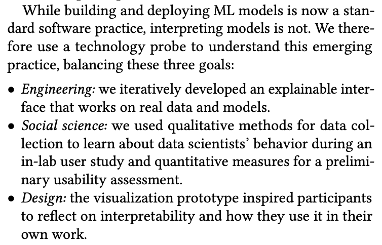
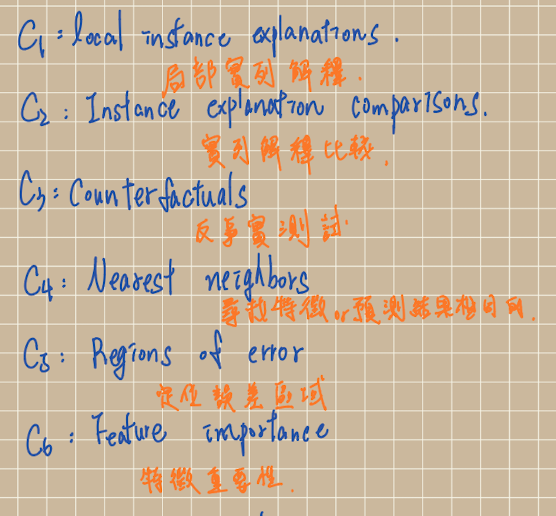
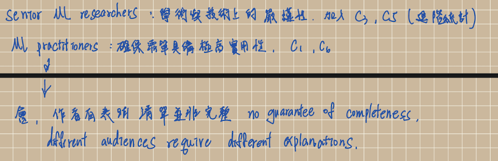

##  一段話總結

#### 前一篇論文重點在於預測計算上，這次重點則是在於解釋機器學習要，如何解釋、要從哪個方向解釋，還有哪些層面要考慮，也提出了相當完整的歸納法。

## 為什麼用「半成品 prototype + 訪談」而不是「上線後問卷」？
### 

### 設計探針的核心動機，三個目標說明了靜態問卷無法達成的研究目的

### Engineering:探針能讓後端研究者觀察前端使用者反應與狀態，而問卷通常在事後詢問感受難免失真。

### Social Soience:使用 gualitative methods 來學習行為，ex:訪談。解釋模型是一個動態過程，問卷只能搜集到結果。

### Desing:Inspire reflection 透過互動過程會啟發出不同問題需求。

## 9 位受試者（4 位資深 ML 研究者 + 5 位 ML 實務工作者）的組成對 C1–C6 的歸納有什麼影響？換一批受試者 C1–C6 會變嗎？

### 

### 

## 各自的需求語句（不是定義，是動機——使用者想做什麼）。能各默寫一條訪談 quote 嗎？

### 針對醫療層面設計出的問題

#### c1 Local instance explanations:病人身上高達85%的癌症風險預測，哪個生理指標異常？需要看到特徵貢獻度。

#### c2 Instance explanation comparisons :兩位病人風險指數一模一樣，但發病原因都不同。

#### c3 Counterfactuals: 他需要把體重減到幾公斤，模型預測的罹癌風險才會降到安全值以下？

#### c4 Nearest neighbors :生理特徵最相似、且已有最終確診結果。

#### c5 Regions of error: 若這位病人年齡或生理指標落在數據極度稀缺區間，模型的預測信心就會像講改為依靠臨床經驗或者開學術研討會。

#### c6 Feature importance:若模型前三名的預測特徵不符合基本病理學機制（病歷號碼預測死亡率），故必須有模型常識審查。

## Shape Curve / Instance Explanation / Interactive Table 各對應 C 幾？hover 怎麼聯動？

#### Shape Curve View ：C5（誤差與數據密度）、C6（全局特徵重要性）

#### Instance Explanation View: C1（特定病人解釋）、C2（兩位病人對比）

#### Interactive Table :C4(鄰近數據)

#### Hover 曲線圖->觸發 C3，在函數圖表上懸停或者滑過，使用這能對任何特稱進行互動式反事實提問。

## 設計探針方法論的本質

#### 研究人類行為，又重新放回機器學習當中

## RQ1（全域 vs 局部）/ RQ2（互補 vs 互斥）/ RQ3（互動性）三個發現中對你最有啟發的一個 + 為什麼

#### RQ3（互動性）我覺得這節省了很多時間，傳統上，醫生要花費大量心力比對多張靜態圖表、逐一查表計算才能評估患者的發病風險，這在秒級決策的臨床現場極耗時間；然而 GAMUT 的即時互動性（如 Hover/Brush 觸發的反事實模擬）能讓醫生直接在生理指標曲線上滑動游標，系統便即時運算出「當血壓降至 120 mmHg 時，心衰竭機率會如何改變」，這種將複雜計算轉化為動態直觀反饋的機制，大幅降低了臨床人員的認知負載與時間成本。

## §3 形成性研究訪談中你覺得最有衝擊力的一條原文 quote + 為什麼選它

#### c3 Counterfactuals:因為我覺得這最後會牽扯到很多問題，第一點設計師的資訊盲區，第二點機器學習的相關性不等於因果關係，例如瘦不等於我沒有過高的內障脂肪。

## 至少 2 個還沒搞懂的地方

#### 文中有提到Given a house and its predicted price of $250,000, what would I have to change to increase its predicted price to $300,000? 提出的意見真的有建設性嗎？例如可能要再花100裝潢讓房屋價值提升。

#### 在 RQ1 中，專家如何利用解釋工具進行「資料挖掘」？