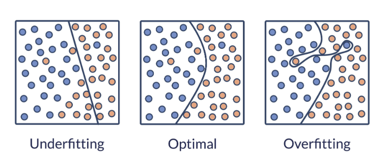

## 一段話總結 

#### 看完這篇論文 我覺的這次重點放在glassbox 的準確度上 包括Pairwise Interactions和透過Round-robin機制消除共線性的問題。

## Glassbox vs Blackbox 各 2 個例子

#### Glassbox 線性模型與決策樹
#### Blackbox 深度神經網路與Random Forests

## 為什麼把 Glassbox 和 Blackbox 放在同一個套件？這個套件試圖解決的是哪一類社群問題（不只是技術問題）？

#### 文中提到的是Ease of comparison 透過提供統一的API及內建的可擴充視覺化平台，讓開發者可以更容易地在同一個基準上比較多種解釋方法。

#### 在Gamut論文中提到 當演算法開始佔據大窩數人的決定時 政府也開始介入監管例如歐盟《通用資料保護規則》（GDPR）第 13 與 22 條中，明確賦予了當事人「解釋權」（right to explanation），規定任何會影響個人法律地位的演算法決策，都必須提供解釋，解決了在機器學習中資料來源無法說明的問題

## 統一 API 跟 sklearn 哪裡像、哪裡不一樣？「Ease of comparison」具體怎麼體現？

#### InterpretML 是高度參考 scikit-learn

#### 相似之處 保留核心套件，如：宣告logisticRegression() ,或者進行資料訓練fit (x,y) 等方法

#### 相異之處 將重點放置在解釋上，如：一般scikit-learn 使用.predict()來展生解果，而InterpretML在架構中增加了Explaine、Explanation物件，還引入了explain_goble(),explain_local()等語法，最後也提供show() function 渲染出互動式圖表。

## g(E[y]) = β₀ + Σ fⱼ(xⱼ)：g 是什麼？β₀ 是什麼？多了 pairwise 變什麼？

#### g(link-function)讓同一個架構適應『回歸（數值預測）』『分類（類別預測）』，β₀ Intercept(截距) 平均預測的基準值，加入了pairwise interactions 提升了模型的準確度與效能，因為傳統的分析方式跟現實世界中特徵之間存在綜合效應，透過fij(xi,xj)模型能夠將兩個特徵合併在一起額外影響函數。

## round-robin boosting 每一輪做什麼？為什麼要 round-robin？round-robin boosting 的演算流程

#### Gradient boostion and one feature at a time combine very low learning rate

#### Decrease Co-linearity and feature order does not matter

#### One feature at a time->Round-robin Cycling->Very low learning rate->Find the perfet fj
​
 

## bagging 怎麼帶來信賴區間？bagging vs boosting 在 EBM 裡分別扮演什麼角色？

#### 從 Bootstrap Aggregation 方法來看 Bootstrap：抽取後放回，Aggregation：取最後成績作為結果，變異數則作為對模型的不確定性（a part of shadow, or shaded area around the line in the graph）

### Boosting

#### 梯度提升 Round-Robin 模型在訓練時一次只針對一個特徵進行訓練very low learing rate，減少 Co-linearity 干擾，能精準釐清並學習到特徵的最佳fj

### Bagging

#### 準確性及穩定性 文中提到parameters: 100 inner bage,100 outer bag ,5000 epochs,learning rate of 0.01. Boosting 的過程受到嚴格的限制，為了防止overfitting 使用了100 inner bage，主要作用就是降低變異數，平均後曲線就會變得平滑。

## automatic interaction detection 怎麼篩選——FAST 在做什麼？

#### 在參考論文中，研究團隊提出FAST（Fast Algorithm for Selection Terms）的排序演算法

#### 先學基礎的單一特稱->找出殘差「單一特徵無法解釋的剩餘規律」->Fast Scanning 建立簡單的2D樹->Ranking-> 只挑選前 K 名正式加入模型訓練

## EBM 跟 pyGAM 至少 3 個差異

|  | EBM| pyGAM|
| -------- | -------- | -------- |
| 執行語言     | Python   | C++/Python     |
|底層技術|統計樣條函數|梯度提升數|
|準確度|較一般|如同random forest or XGBoost|

## 至少 2 個還沒搞懂的地方

#### 解釋器是如何將殘差 轉換為交互作用評分的？

 透過 FAST (Fast Amplitude Selection Tracker) 的演算法算出來的。

#### EBM 訓練中的「內部裝袋」與「外部裝袋」有何不同？

##### 外部裝袋

建立複數模型 (提升泛化度，算信賴區間)

##### 內部裝袋

穩定梯度更新 (防止單次迭代過擬合)
